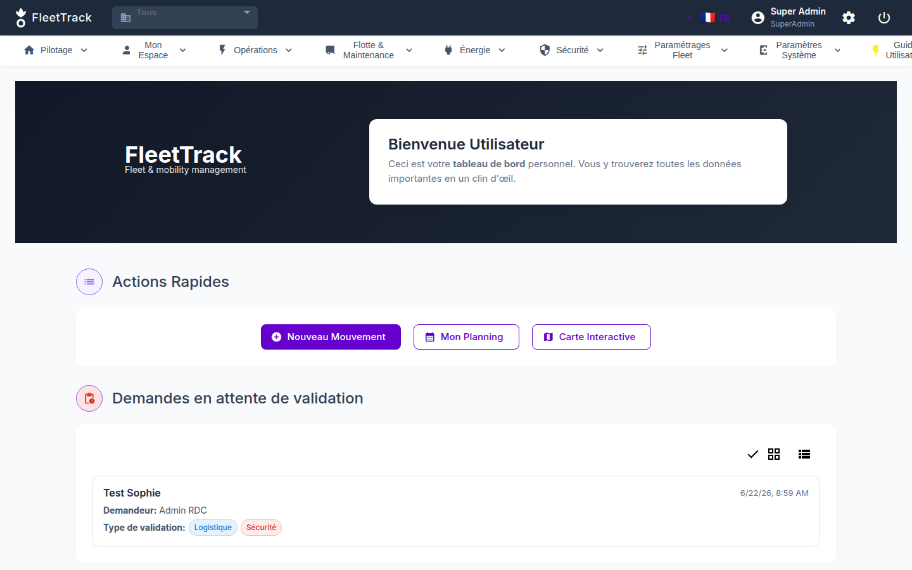
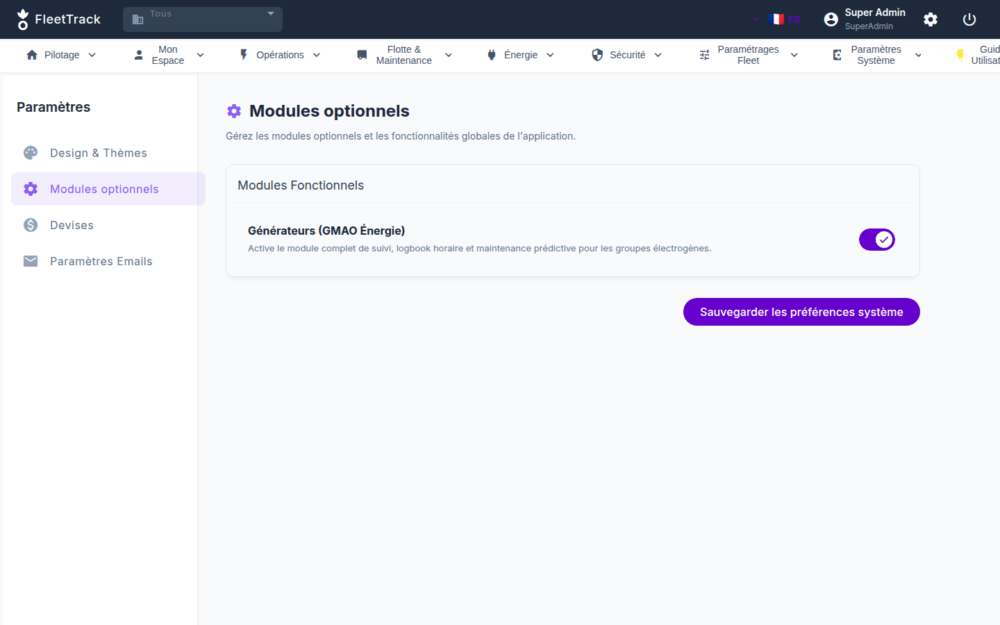
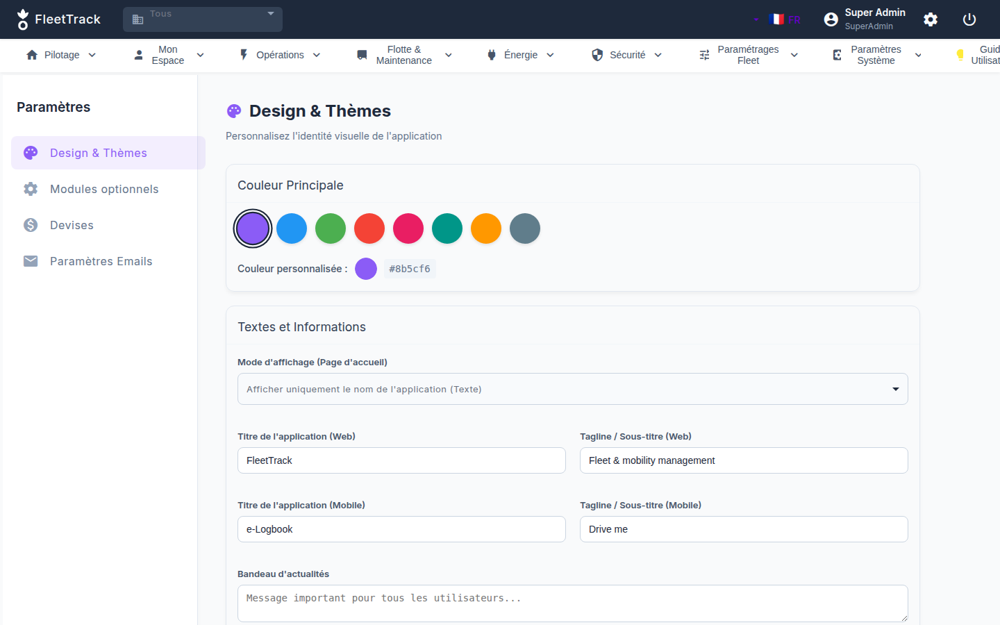

# 🚛 FleetTrack - Smart Fleet Management System


*🇬🇧 English below | 🇫🇷 Français plus bas*

---

> **Built for Humanitarian Logistics 🚑**
> FleetTrack is a comprehensive open-source web and mobile progressive web app (PWA) designed specifically to manage vehicle fleets, logbooks, and predictive maintenance for Humanitarian NGOs operating in challenging environments. It is a 100% non-profit and open-source project aiming to provide NGOs with a modern, free, and robust tool.

## 📸 Screenshots

<div align="center">
  
  <br><br>
  <p float="left">
    
    
  </p>
</div>

---

## 👀 Looking for Contributors & Reviewers

I am currently looking for feedback on:
- **Code Quality & Best Practices**
- **Architecture & Maintainability** (Shared Services, Symlinks handling)
- **Scalability**
- **Security**

**Context:** This project was heavily built using AI-assisted development tools. While it works perfectly in production and fulfills all the operational needs, I'd love expert validation from seasoned developers to ensure the foundations are rock solid before scaling.

If you have experience in Angular, Node.js, or PWA development, I would really value your thoughts! Please feel free to open an issue, submit a PR, or reach out directly.

---

## 🇬🇧 About FleetTrack (English)

FleetTrack is a comprehensive Fleet Management System designed for complex logistical operations, including NGO fields. It is divided into two main applications sharing a common backend:
1. **Admin Web App (`gestion-des-deplacements`)**: A full dashboard for managers to track vehicles, schedule maintenance, manage drivers, and monitor fuel consumption.
2. **Driver Mobile PWA (`e-logbook`)**: An offline-first mobile application for drivers to log their trips, record fuel fillings, and submit vehicle checklists.

### Key Features
- **Offline-First PWA (E-Logbook)**: Built with Service Workers and IndexedDB. Drivers can use the app without an internet connection in remote areas. Data syncs automatically when the connection is restored.
- **Shared Architecture**: Both the Web and Mobile apps share core services (like `SettingsService`) via a symlink-based architecture (`/Angular/shared/`) to ensure a single source of truth without duplicating code.
- **Dynamic Theming**: Configurable UI through CSS variables to allow different branding based on the environment.
- **i18n Support**: Full multilingual support (English, French).
- **Maintenance Tracking**: Automated cost calculation, PDF invoice parsing, and lifecycle tracking.

### 🚀 Getting Started

#### Prerequisites
- Node.js (v18+)
- Angular CLI (v17+)
- MongoDB (Local or Atlas)

#### Installation

1. **Clone the repository**
   ```bash
   git clone https://github.com/Archi-web3/FleetTrack.git
   cd FleetTrack/Angular
   ```

2. **Backend Setup**
   ```bash
   cd backend
   npm install
   cp .env.example .env
   # Update the .env file with your MongoDB URI
   npm run start
   ```

3. **Frontend Setup (Admin Web App)**
   ```bash
   cd ../gestion-des-deplacements
   npm install
   ng serve -o
   ```

4. **Frontend Setup (Driver Mobile App)**
   ```bash
   cd ../e-logbook
   npm install
   ng serve --port 4201 -o
   ```

---

## 🇫🇷 À propos de FleetTrack (Français)

FleetTrack est un système complet de gestion de flotte automobile, pensé pour des opérations logistiques complexes (notamment sur le terrain pour les ONG). Il est composé de deux applications partageant le même Backend :
1. **L'application Web Admin (`gestion-des-deplacements`)** : Un tableau de bord complet pour les gestionnaires (véhicules, entretiens, chauffeurs, carburant).
2. **La PWA Mobile Chauffeur (`e-logbook`)** : Une application mobile pensée pour fonctionner hors-ligne (Offline-first) permettant aux chauffeurs d'enregistrer leurs trajets et leurs pleins.

### Fonctionnalités Clés
- **PWA Hors-Ligne** : Utilisation de Service Workers et IndexedDB pour garantir une utilisation en zone blanche. Synchronisation automatique au retour réseau.
- **Code Partagé** : Architecture par liens symboliques (symlinks) pour mutualiser les services vitaux (ex: `SettingsService`) entre les applications Web et Mobile.
- **Multilingue (i18n)** : Support complet de l'anglais et du français.
- **Gestion des Entretiens** : Calcul des coûts, historiques complets et extraction d'invoices PDF.

### 🚀 Installation (Rapide)

1. **Backend** : Allez dans `/Angular/backend`, faites `npm install`, copiez `.env.example` en `.env` et lancez `npm run start`.
2. **Web App** : Allez dans `/Angular/gestion-des-deplacements`, faites `npm install` puis `ng serve`.
3. **Mobile PWA** : Allez dans `/Angular/e-logbook`, faites `npm install` puis `ng serve --port 4201`.

---
*Built with ❤️ (and AI).*
